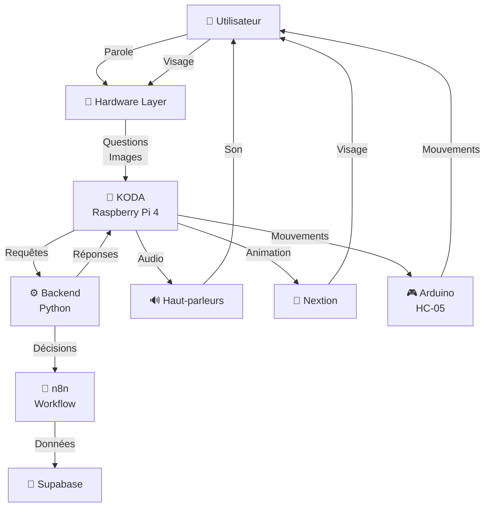
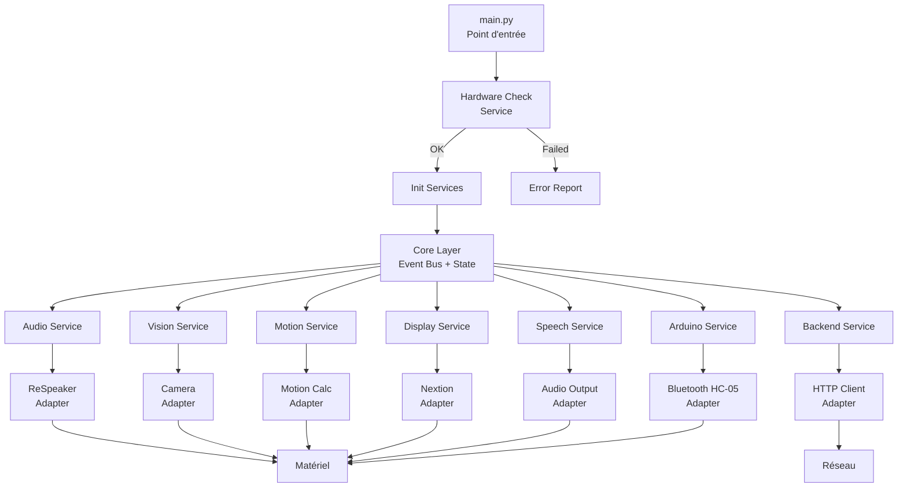
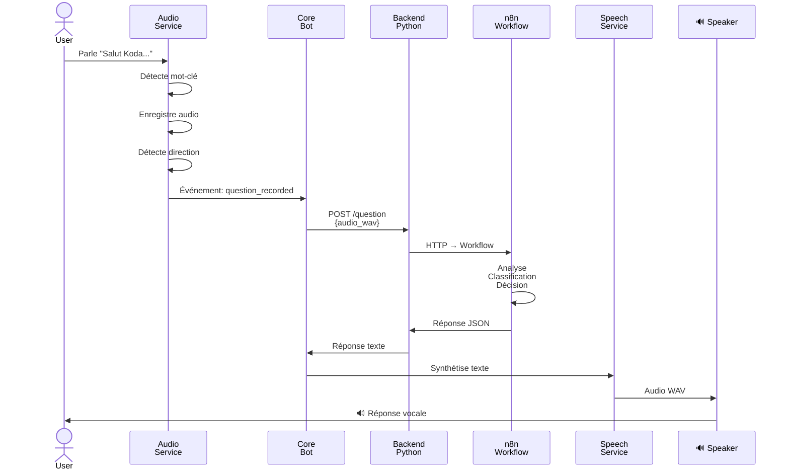
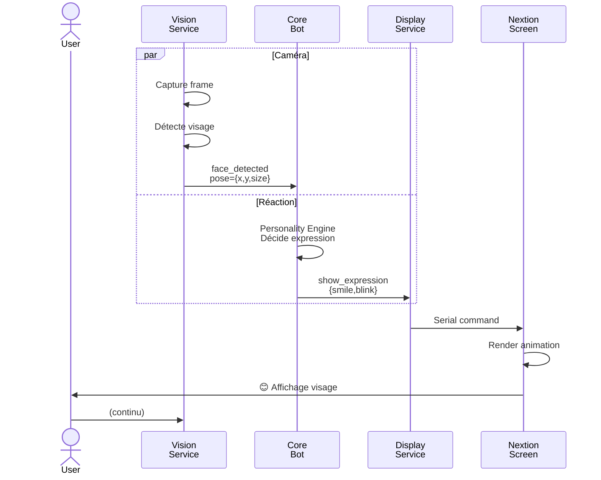
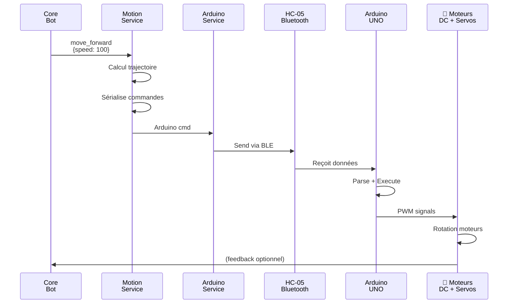
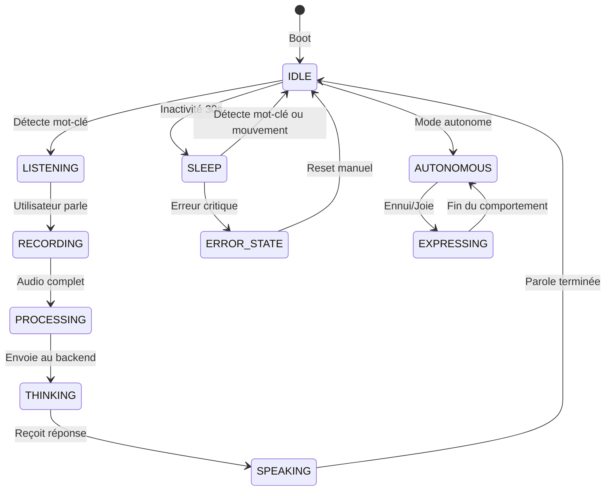
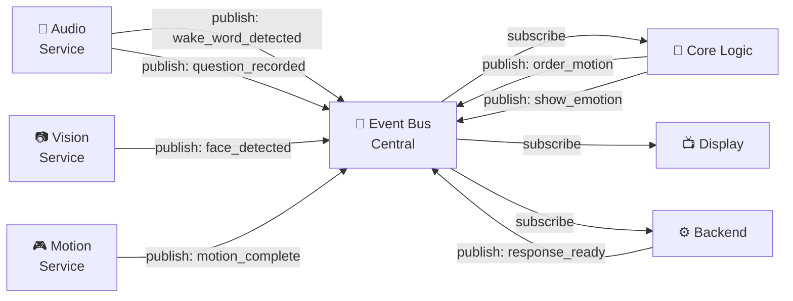
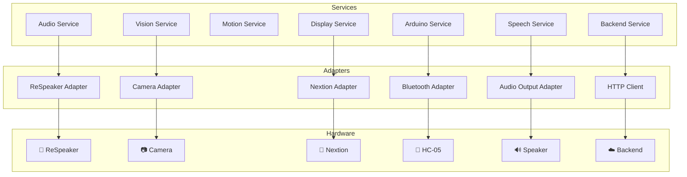

# 📊 Diagrammes Architecture KODA

## 1. Architecture globale système



## 2. Couches Raspberry Pi



## 3. Flux audio complet



## 4. Flux visuel (caméra + Nextion)



## 5. Flux moteur et Arduino



## 6. État machine du robot



## 7. Communication événements (Event Bus)



## 8. Hiérarchie services & adapters



## 9. Dépendances Python

```
📦 KODA Backend

├── 🔧 Core
│   ├── asyncio (async event loop)
│   ├── pydantic (validation)
│   └── python-dotenv (config)
│
├── 🎤 Audio
│   ├── pyaudio (capture)
│   ├── respeaker (driver)
│   └── scipy (traitement audio)
│
├── 📷 Vision
│   ├── opencv-python (caméra + detection)
│   └── numpy (algos)
│
├── 📱 Display
│   ├── serial (Nextion)
│   └── PIL (images)
│
├── 🌐 Communication
│   ├── requests (HTTP)
│   ├── aiohttp (async HTTP)
│   └── paho-mqtt (MQTT optionnel)
│
├── 🔊 Audio Output
│   ├── pydub (WAV processing)
│   └── pyaudio (playback)
│
└── 🧪 Tests
    ├── pytest
    ├── pytest-asyncio
    └── pytest-mock
```

## 10. Timeline de développement

```mermaid
gantt
    title Développement KODA - Raspberry Pi
    
    section Foundation
    Architecture :arch, 2026-05-06, 7d
    Config + Logs :config, after arch, 7d
    Hardware Check :hwcheck, after config, 5d
    
    section Hardware
    Adapters :adapt, after hwcheck, 14d
    Tests adapters :test_adapt, after adapt, 7d
    
    section Core
    Event Bus :bus, after hwcheck, 7d
    Services :serv, after bus, 14d
    State Machine :state, after serv, 7d
    
    section Intelligence
    Personality :pers, after state, 10d
    Autonomy :auton, after pers, 10d
    
    section Backend
    Backend Client :backend, after state, 14d
    Integration :integ, after backend, 10d
    
    section Release
    Optimization :opt, after integ, 14d
    Production :prod, after opt, 10d
    
    milestone mvp, 2026-08-01, 1d
```

---

**Ces diagrammes décrivent :**
1. L'écosystème global
2. L'architecture interne Raspberry
3. Le flux audio complet (parole)
4. Le flux visuel (vision)
5. Le pilotage des moteurs
6. L'état machine du robot
7. Le bus d'événements
8. La hiérarchie des services
9. Les dépendances
10. Le timeline de développement
